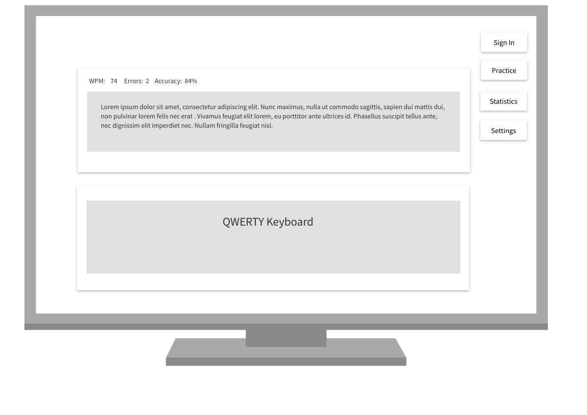

# Coding Focused Typing Tutor
#### General Assembly SEIR 110 Capstone Project

### Project Description

- Coding Focused Typing Tutor
    - Place for beginner and intermediate programmers to work on their typing speed with coding specific symbols, commands, and phrases.  The user will be able to sign in and practice whatever language they prefer.  Statistics will show live at the top of the typing block and save to the user's profile.  There will be a qwerty keyboard on the bottom of the screen, showing the current keystrokes.

***

### User Story

*** 

### Wireframes

***

### Verision 1 - MVP

- React Front End
- generated code block
- timer
- typing stats
    - wpm
    - errors
    - errors per min
- 

### V2 

- qwerty keyboard on screen showing letters typed
- django backend
- user authentication
- saved stats
- 

### V3 - POST MVP

- graphs in user stats
- choice of programming language
- about/developer page - self descriptions (devestatingly humble, most humblest) unique things (twice as many vowels as consonents in my first name (that's a lot of vowels!)
- 

### Post-Post-MVP

- color palette changed in settings
- dark/light theme
- neon option with dark background, give glow to borders, transition in and out during key press
- realworld code blocks, picked up from open source or free access (ex: code portions of the react application)
- 

*** 

### Components
| Component              | Priority | Estimated Time | Actual Time |
| --------- | :------: | :------: | :------: |
**V1**
| Wireframe | H | 45 min | 45 min |
| Timer | H | 30 min |
| Code Block | H | unknown | 
| Typing Stats | H | 2 hrs |
| React Architecture | H | 2 hrs |
| User Stories | H | 1 hr |
| Landing Page | H | 1 hr |
| Basic CSS | H | 2 hr |
**V2**
| Django backend | H |
| User Authentication | H | 2 hr |
| Stats database | H | 2 hr |
**V3**
| Qwert keyboard | M | 5 hrs |
| - keyboard component | M | 30 min |
| - letters component | M | 30 min |
| Language Choice | M | 2 hr | 
**Post-Post-MVP**
| User provided code | L | unknown | 

***

### Additional Libraries

***

### Additional APIs

***

